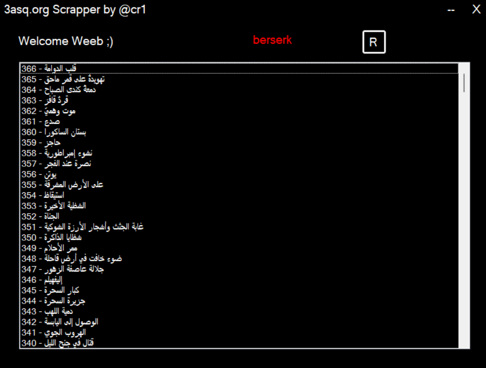

# 3asq-manga-scrapper

  
  

### 
This is just a simple 3asq.org downloader 🗄️
  
  

- **🐥 Nobiie ? just RUN! and PASTE!!!!! [HERE](https://drive.google.com/file/d/1H7laPjyCUucPbOhHI8fqGpZrpa2Eg2Sw/view?usp=sharing)**  
  

- 🧠 Are you geek ? Why don't you try adding Multi download [HERE](https://github.com/imcr1/3asq-manga-scrapper/tree/main/src)
  

- ⚡ String[] Facts = new string[] ["My first programm in **C#** 😎" , "Especially made for  **BERSERK**" ] 

  

 
   

## Connect with me  

  

  
  

